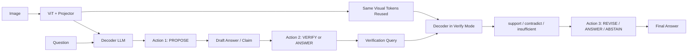

# AVV: Answer, Visual Evidence, Verify

This repository is now organized around a different hypothesis:

**many spatial failures in VLMs come from committing too early, before the model has verified its own visual claim.**

The current direction is no longer "add more reasoning modules." It is:

- keep the original `ViT + projector + decoder` VLM
- run it as a multi-step policy instead of a one-shot answerer
- train the policy to decide when to propose, verify, revise, and stop

## Core Idea

Standard VLMs optimize `p(y | x, q)` and are rewarded for answering directly.
AVV changes the problem structure from:

`(x, q) -> y`

to:

`(x, q) -> propose -> verify -> revise or answer`

This turns spatial QA into a **self-verification policy learning** problem rather than a pure direct-generation problem.

## Repository Layout

```text
vlm/
├── configs/
│   ├── base.yaml
│   ├── stage1_pointer.yaml
│   ├── stage2_verifier.yaml
│   └── stage3_joint.yaml
├── docs/
│   └── method.md
├── scripts/
│   ├── build_relation_data.py
│   ├── train_joint.py
│   ├── train_pointer.py
│   └── train_verifier.py
├── src/
│   ├── data/
│   │   ├── relation_dataset.py
│   │   └── builders/
│   ├── eval/
│   ├── losses/
│   ├── model/
│   │   ├── backbone/
│   │   ├── cropper/
│   │   ├── pointer/
│   │   ├── proposal/
│   │   ├── verifier/
│   │   └── avv_model.py
│   └── train/
└── requirements.txt
```

## AVV Pipeline



## RL Framing

AVV is best viewed as a sequential decision problem.

- state: image, question, current draft, verification history, remaining budget
- action: `PROPOSE`, `VERIFY`, `REVISE`, `ANSWER`, `ABSTAIN`
- reward: answer correctness, verification consistency, evidence efficiency, and stopping cost

The main goal is not to relearn vision or language from scratch. It is to learn a better **control policy** over an existing VLM.

## Training Stages

### Stage 0: Supervised Warm Start
- teach the model three modes with structured prompts:
- `draft mode`
- `verify mode`
- `final mode`

### Stage 1: Oracle-Guided Imitation
- build trajectories from synthetic data or box-derived relations
- imitate when to verify, when to revise, and when to stop

### Stage 2: RL Fine-tuning
- optimize the self-verification policy
- reward correct final answers
- reward consistent verification
- penalize unnecessary extra verification steps

## Method Draft

- English: [docs/method.md](/Users/fwk/Downloads/vlm/docs/method.md)
- 中文版: [docs/method_zh.md](/Users/fwk/Downloads/vlm/docs/method_zh.md)

## Quick Start

Install dependencies:

```bash
pip install -r requirements.txt
```

Build relation data:

```bash
python scripts/build_relation_data.py --help
```

Run stage-wise training:

```bash
python scripts/train_pointer.py --config configs/stage1_pointer.yaml
python scripts/train_verifier.py --config configs/stage2_verifier.yaml
python scripts/train_joint.py --config configs/stage3_joint.yaml
```

## Current Status

This repo is intentionally reset to a research skeleton:
- docs now reflect the RL-style self-verification direction
- data builders still provide relation-level supervision for warm start
- code remains a scaffolding repo and will need a later pass to fully match the shared-policy formulation
