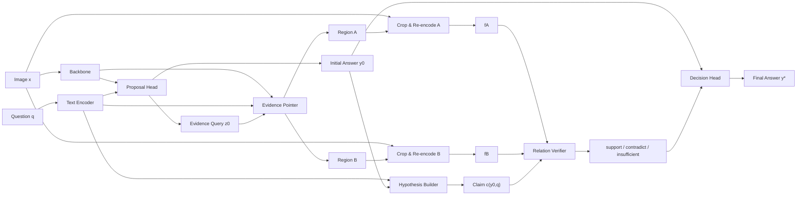

# AVV: Answer, Visual Evidence, Verify

This repository is rebuilt around a different hypothesis:

**many spatial failures in VLMs come from unverified visual readout, not only weak reasoning.**

Instead of adding more conditioning inside the encoder, AVV inserts a lightweight verification loop after the first answer proposal:

1. propose an answer,
2. point to the visual evidence,
3. re-read that evidence at higher fidelity,
4. verify whether the claim is supported,
5. revise or commit the final answer.

## Core Idea

Standard VLMs optimize `p(y | x, q)` and are rewarded for answering directly. AVV changes the problem structure:

`(x, q) -> y0 -> evidence(A, B) -> re-perceive -> verify -> y*`

This turns spatial QA into **hypothesis verification** rather than pure direct generation.

## Repository Layout

```text
vlm/
├── configs/
│   ├── base.yaml
│   ├── stage1_pointer.yaml
│   ├── stage2_verifier.yaml
│   └── stage3_joint.yaml
├── docs/
│   └── method.md
├── scripts/
│   ├── build_relation_data.py
│   ├── train_joint.py
│   ├── train_pointer.py
│   └── train_verifier.py
├── src/
│   ├── data/
│   │   ├── relation_dataset.py
│   │   └── builders/
│   ├── eval/
│   ├── losses/
│   ├── model/
│   │   ├── backbone/
│   │   ├── cropper/
│   │   ├── pointer/
│   │   ├── proposal/
│   │   ├── verifier/
│   │   └── avv_model.py
│   └── train/
└── requirements.txt
```

## AVV Pipeline



## Training Stages

### Stage 1: Pointer Pretraining
- supervise evidence localization with GT boxes or relation-derived pseudo boxes
- train only the pointer and light query heads

### Stage 2: Verifier Pretraining
- crop regions from GT evidence
- train a verifier to classify `support`, `contradict`, or `insufficient`
- add counterfactual relation swaps and flip-consistency

### Stage 3: Joint Fine-tuning
- connect proposal, pointer, cropper, verifier, and decision head
- optimize answer quality together with evidence faithfulness

## Method Draft

- English: [docs/method.md](/Users/fwk/Downloads/vlm/docs/method.md)
- 中文版: [docs/method_zh.md](/Users/fwk/Downloads/vlm/docs/method_zh.md)

## Quick Start

Install dependencies:

```bash
pip install -r requirements.txt
```

Build relation data:

```bash
python scripts/build_relation_data.py --help
```

Run stage-wise training:

```bash
python scripts/train_pointer.py --config configs/stage1_pointer.yaml
python scripts/train_verifier.py --config configs/stage2_verifier.yaml
python scripts/train_joint.py --config configs/stage3_joint.yaml
```

## Current Status

This repo is intentionally reset to a research skeleton:
- configs define the AVV training stages
- data builders generate relation-level samples from box annotations
- model modules expose proposal, pointer, crop, verification, and decision interfaces
- training entrypoints are minimal and ready for implementation
